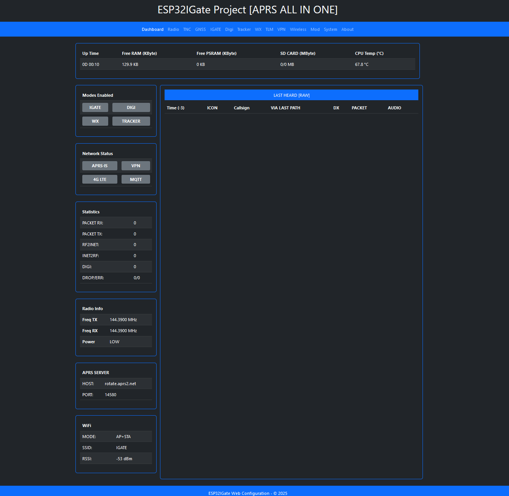
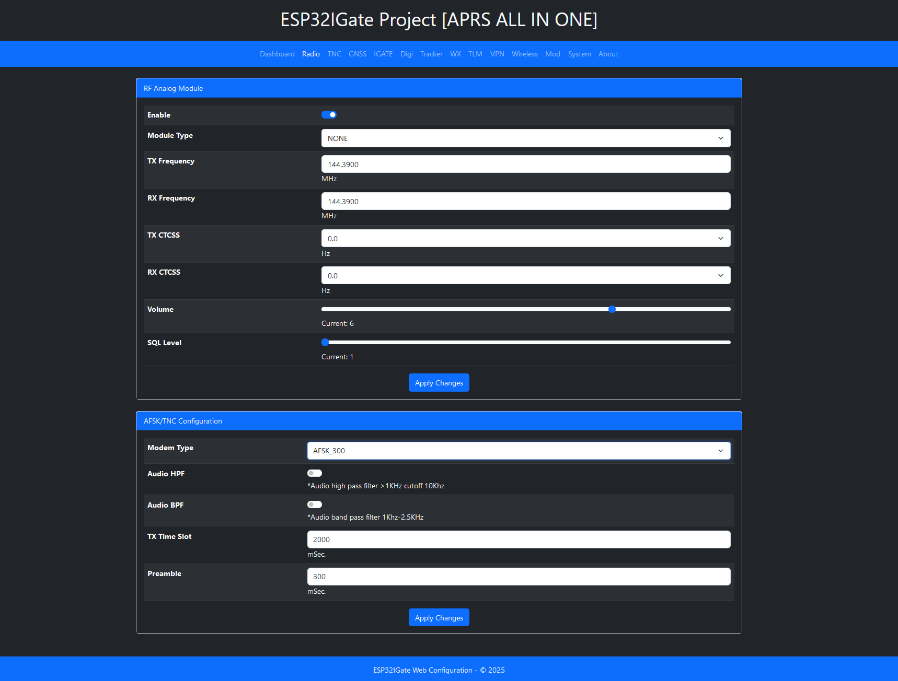

# ESP32APRS Simple Project (Optimized Fork)

This is an optimized fork of the amazing [ESP32APRS project](https://github.com/nakhonthai/ESP32APRS) originally created by **HS5TQA**. The purpose of this fork is to improve and simplify its functionality while maintaining the core features of the original project.

## Overview

ESP32APRS is an Internet Gateway (IGate), Digital Repeater (Digi), Tracker, Weather Station (WX), and Telemetry (TLM) device with a built-in TNC implemented for the Espressif ESP32 processor.

---

## Features

- **Supported Hardware:** ESP32DR Simple, ESP32DR, DIY alternatives
- **Supported RF Modules:** SA8x8/FRS VHF/UHF/350 models
- **Supports:**  
  - APRS Internet Gateway (IGATE)  
  - APRS Digital Repeater (DIGI)  
  - APRS Tracker (TRACKER)  
  - GNSS External Module via UART0-2 and TCP Client  
  - External TNC Module via UART0-2 and Yaesu Packet  
  - IGATE/DIGI/WX with fixed or moving position via GNSS
- **Development Environment:** ESP-Arduino on Visual Studio Code + PlatformIO
- **Modem Support:**  
  - AFSK 1600/1800Hz 300bps (For HF Radio)  
  - AFSK Bell202 1200bps (For VHF/UHF Radio)  
  - Software modem for encoding and decoding
- **Monitoring and Configuration:**  
  - Display information and statistics  
  - Wi-Fi multi-station or Access Point  
  - Web Service for configuration and control  
  - Packet filtering for IGATE, DIGI, and display  
  - Audio filters: BPF, HPF  
  - VPN using WireGuard  
  - Global time zone support  
  - Web service authentication login  
  - Packet transmission and reception displayed on LED and OLED screen  

---

## Hardware Screenshots

   

---

## Hardware Modifications

---

## Web Service Screenshots

  

---

## ESP32DR SA868

- Project shared [here](https://oshwlab.com/APRSTH/esp32sa818)  
- Schematic [here](doc/ESP32DR_SA868/ESP32DR_SA868_sch.pdf)  
- PCB Gerber files [here](doc/ESP32DR_SA868/ESP32DR_SA868_Gerber.zip)  

---

## ESP32DR Simple

The ESP32DR Simple Circuit is a compact interface board for connecting to a transceiver.

- PCB dimensions: 64x58mm  
- Single-layer PCB  
- RJ11 6-pin output to Radio  

### Schematic

### CAD data
 
The gerber data is [here](doc/Gerber_ESP32DR_Simple.zip)

The PCB film positive is [here](doc/PCB_Bottom.pdf)

The PCB film negative is [here](doc/PCB_Bottom_Invert.pdf)

The PCB Layout is [here](doc/PCB_Layout.pdf)

The Schematic PDF is [here](doc/ESP32DR_Simple_Schematic.pdf)

### BOM list  

| Reference | Value | Description |
|---|:---:|---|
| U1 | ESP32 DEVKIT | DOIT ESP32 DEVKIT (ESP32 module) |
| RP2 | 1K | VR 3362W (Potentiometer for output audio adjustment) |
| RP1 | 10K | VR 3362W (Potentiometer for input audio adjustment) |
| RJ11 | RJ11-6P6C | RJ11 module jack with 6 pins |
| R13, R12, R11, R5, R3, R9 | 1K | R 1K 1/4W (Color code: Brown, Black, Red) |
| R7, R18, R19 | 100R | R 100R 1/4W (Color code: Brown, Black, Black) |
| R6, R2, R1 | 10K | R 10K 1/4W (Color code: Brown, Black, Orange) |
| R4 | 3K | R 3K 1/4W (Color code: Orange, Black, Red) |
| R10 | 33K | R 33K 1/4W (Color code: Orange, Orange, Orange) |
| Q1 | 2N3904 | NPN transistor (TO-92) |
| LED3 | LED 3.5mm | Yellow LED, indicates TX signal transmission |
| LED2 | LED 3.5mm | Green LED, indicates RX signal reception |
| LED1 | LED 3.5mm | Red LED, indicates power is on |
| L1 | L or JMP | L Isolate or Jumper |
| C11 | 100uF/6.3V | Electrolytic capacitor |
| C4, C5 | 100nF | Multilayer ceramic capacitor |
| C6 | 470uF/10V | Electrolytic capacitor |
| C1, C3, C10 | 100nF or 0.1uF | Polypropylene capacitor |
| C2 | 10nF or 0.01uF | Polypropylene capacitor |
| D2, D1 | 1N4148 | Diode or replace with 0.01uF capacitor |

**Notes:**  
- *R18 and R19 are optional.*  
- *D2 and D1 can be replaced with 10nF multilayer ceramic capacitors.*  
- *If connecting to a transceiver via an external mic pin, replace R4 with 100K.*

The Howto DIY is [here](doc/ESP32DR_DIY-Thai.pdf)

### Mounting drawing

### Transceiver connection

Solder jumper is needed depending on a transceiver.

|Manufacture|RJ11-1 (+VIN)|RJ11-2 (SPK)|RJ11-3 (PTT)|RJ11-4 (GND)|RJ11-5 (MIC)|RJ11-6 (SQL)|
|---|---|---|---|---|---|---|
|Alinco DR-135(DB9)|-|2|7|5|9|1|
|IC2200(RJ45)|-|SP|4|5|6|-|
|FT-2800(RJ11)|-|SP|1|3|2|-|
|HT Mic Cable|-|SPK|PTT|GND|MIC|-|

for Alinco DR-135(DB9)

for ICOM IC2200(RJ45)

for Yaesu FT-2800(RJ11)

for Handheld

---

## ESP32IGate firmware installation (do it first time, next time via the web browser)
- 1.Connect the USB cable to the ESP32 Module.
- 2.Download firmware and open the program ESP32 DOWNLOAD TOOL, set it in the firmware upload program, set the firmware to ESP32IGate_Vxx.bin, location 0x10000 and partitions.bin at 0x8000 and bootloader.bin at 0x1000 and boot.bin at 0xe000, if not loaded, connect GPIO0 cable to GND, press START button finished, press power button or reset (red) again.
- 3.Then go to WiFi AP SSID: ESP32IGate and open a browser to the website. http://192.168.4.1 password: aprsesp32 Can be fixed Or turn on your Wi-Fi router.
- 4.Push **BOOT** button long >100ms to TX Position and >10Sec to Factory Default

---

## PlatformIO Quick Start

1. Install [Visual Studio Code](https://code.visualstudio.com/) and [Python](https://www.python.org/).  
2. Search for and install the PlatformIO plugin in Visual Studio Code.  
3. Restart Visual Studio Code and open the `ESP32APRS_T-TWR` directory.  
4. Configure the `platformio.ini` file for your build.  
5. Compile and upload firmware to the ESP32.  

---

## APRS Server Services

- APRS Server: [aprs.dprns.com:14580](http://aprs.dprns.com:14501)  
- APRS Map Service: [http://aprs.nakhonthai.net](http://aprs.nakhonthai.net)

---

## Donate

Support the development of ESP32APRS through [GitHub Sponsors](https://github.com/sponsors/nakhonthai) or [PayPal](https://www.paypal.me/hs5tqa).

---

## Credits & References

- [ESP32TNC Project by amedes](https://github.com/amedes/ESP32TNC)  
- [APRS Library by markqvist](https://github.com/markqvist/LibAPRS)
- [nakhonthai/ESP32APRS](https://github.com/nakhonthai/ESP32APRS)

---

## Changes in This Fork
- Improved stability in [WebServer].
- Added support for [Boostrap 5].
- Optimized [Wifi] for better performance.
- Optimized [WebServer] for better performance.

---

This fork aims to improve usability and enhance features while building on the fantastic work of **HS5TQA**.

---

## Disclaimer
This software is provided "as is", without any warranty of any kind, express or implied, including but not limited to the warranties of merchantability, fitness for a particular purpose, and noninfringement. See the [GNU General Public License](https://www.gnu.org/licenses/gpl-3.0.html) for more details.
